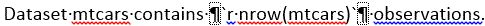
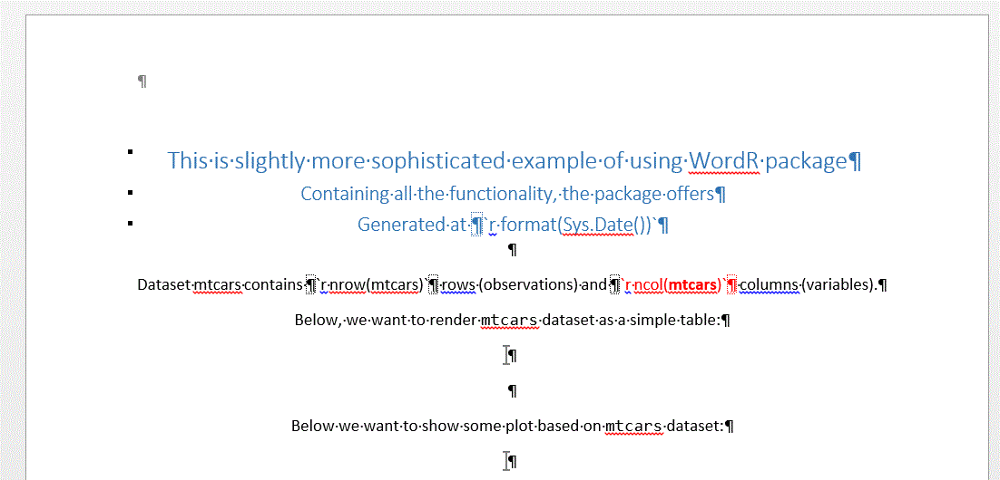
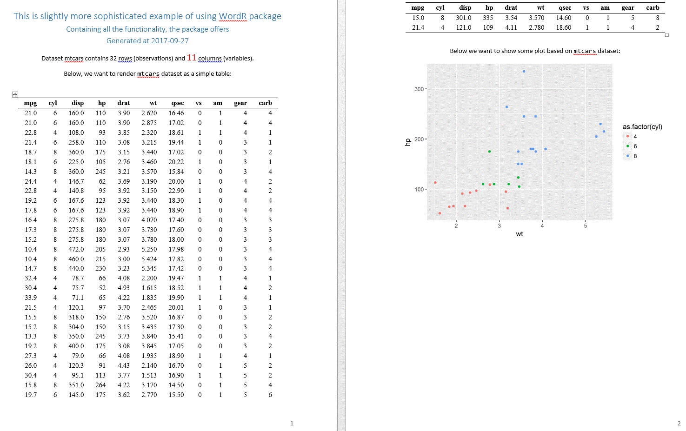

```{r setup, include=FALSE}
knitr::opts_chunk$set(echo = TRUE)
#file.remove("resources/templateMTcarsOutput.docx")

```

## Motivation

One day earlier this year, I was faced with the challenge of creating a report for management. It had to be a MS Word document (corporate requirement, you know). It was supposed to be polished and use many of the standard MS Word features like headers, footers, TOC, Styles like.

I am not a Word guy and besides I wanted to make a reproducible document that would make it easy for me to include R Code and plots in the text. Having no idea what tools were available, I revved up the Google and found several packages including [R2wd](https://CRAN.R-project.org/package=R2wd), [officer](https://CRAN.R-project.org/package=officer) and [ReporteRs](https://CRAN.R-project.org/package=ReporteRs). They are all very good packages, but for different reasons, none of them covered a hundred percent of my needs.  Also, I thought that they make some things unnecessarily complicated (again, for my needs).

For example, I wanted to be able to create the document template that included a significant amount of text and styles. I also wanted to be able to mark a place to add a table or plot and mainly, I wanted to have something like R inline code in R markdown language ([link](http://rmarkdown.rstudio.com/lesson-4.html)).

I found out that with combination of [officer](https://CRAN.R-project.org/package=officer) and [ReporteRs](https://CRAN.R-project.org/package=ReporteRs) packages and some effort, I can achieve what I needed. (It could be done solely with [officer](https://CRAN.R-project.org/package=officer), but the tables and plots creation/insertion in [ReporteRs](https://CRAN.R-project.org/package=ReporteRs) serves me better).

Package [WordR](https://CRAN.R-project.org/package=WordR), in version 0.2.2 on [CRAN](https://CRAN.R-project.org) now, is the result.

## How to use it
This is, I hope, pretty simple. Details are described in the package [vignette](https://CRAN.R-project.org/package=WordR/vignettes/WordR.html). Text below should provide basic understanding.

###MS Word part
As a first step, prepare a Word document with static text, images, headers, footers, styles etc.
In your text, if you need, you can add a R inline code part. It needs to be separated from the rest of the text by style separators at the beginning and the end (insert style separator by pressing `Ctrl+Alt+Enter` (it is preferable to have formatting symbols visible by clicking the "new line" sign button on `Home>Paragraph` panel in MS Word)), and it should have a form of `` `r "\u0060r expression\u0060"` ``, where `expression` is R expression like `1+1`. So the result should look something like this, in the MS Word editor:  

       
  
<br/>

At place, where you want to render a table, insert bookmark named `t_XYZ` where XYZ will be a name of a FlexTable (`ReporteRs::FlexTable`) table which you want to insert.
At place, where you want to render a plot/image, insert bookmark named `p_XYZ` where XYZ will be a name of plot function (`ReporteRs::addPlot.docx`) you want to be used to render the plot/image.

Save the prepared Word template. 

#### Example
Resulting document may look like this (print screen; original document is [here](resources/templateMTcars.docx)):


  

<br/>

If you don't see the file in the MS Word as in the print screen above, please, refer to package [vignette](https://CRAN.R-project.org/package=WordR/vignettes/WordR.html) on how to make the bookmarks and non-printable signs visible.

Mind few things in the example:

* r inline code in the header
* two inline code in the text, second one, formatted in a custom style `red style`
* two bookmarks, one for plot and one for table.
 
###R part

Now, let's switch to R. Install the [WordR](https://CRAN.R-project.org/package=WordR) package (and all the dependencies; Java is required by [ReporteRs](https://CRAN.R-project.org/package=ReporteRs) package, so make sure you have it working for table and plot rendering):
```{r eval=FALSE}
install.packages("WordR")
```

Then you have three functions from the [WordR](https://CRAN.R-project.org/package=WordR) package at your disposal:

* `renderInlineCode` for rendering the R inline code
* `addFlexTables` for inserting FlexTables at the locations defined by the bookmarks (more about FlexTables and it wide variety of formatting possibilities look at `ReporteRs::FlexTable`)
* `addFlexPlots`  for inserting plots/images at the locations defined by the bookmarks

Please refer to the help of each function for details, but in general you provide the path of your prepared Word file as an argument (and the tables or plots respectively) and also the desired path, where you want to have your result file being saved. The function returns that path upon successful execution.

####Back to our example

Assume we saved our file as `templateMTcars.docx` in subdirectory `/resources` located in our working directory:

```{r}
dir(path=paste0(getwd(),"/resources/"),pattern=".docx")
```

Then the rest of the code is simple
```{r eval=FALSE}
library(WordR)
library(ReporteRs)
library(ggplot2)
# prepare outputs (Tables and Plots)
ft_mtcars <- vanilla.table(mtcars)
FT <- list(mtcars = ft_mtcars)
Plots <- list(mtcars1 = function() print(ggplot(mtcars, aes(x = wt, y = hp, col = as.factor(cyl))) + geom_point()))

# render docx
renderInlineCode("resources/templateMTcars.docx","resources/templateMTcarsOutput.docx")
addFlexTables("resources/templateMTcarsOutput.docx","resources/templateMTcarsOutput.docx", FT)
addPlots("resources/templateMTcarsOutput.docx","resources/templateMTcarsOutput.docx", Plots, height = 4)
```

This should result in the rendered file `resources/templateMTcarsOutput.docx` looking like this (prinstcreen with non-printable characters and bookmarks off; in docx format [here](resources/templateMTcarsOutput.docx)):

<br/>
  

<br/>

##Few comments
In my workflow, I let people, who want the report, to prepare the Word template (without the bookmarks and R code). This is better both for me (I can do other things), and for them, as they can format the report the way they want, without iterating with me. Then I take that file, put the R inline code in place, add the bookmarks, and the template is done. 

Additionally, when the result is created, it can be further changed. For example, the person who receives the report from me, may add some interpretation based on the current results, etc., which would be difficult with the traditional Rmd/LateX -> PDF way of reporting.

##Summary

I believe that the [WordR](https://CRAN.R-project.org/package=WordR) package offers something new. I admit that it is a just a small modification of much more powerful packages [officer](https://CRAN.R-project.org/package=officer) and [ReporteRs](https://CRAN.R-project.org/package=ReporteRs), but it simplified things for me a lot. Obviously it will never be the first choice for reproducible research, but I believe it can be useful for few corporate rats and other people who want to produce fully formatted report but do not want to go deep into LateX.


